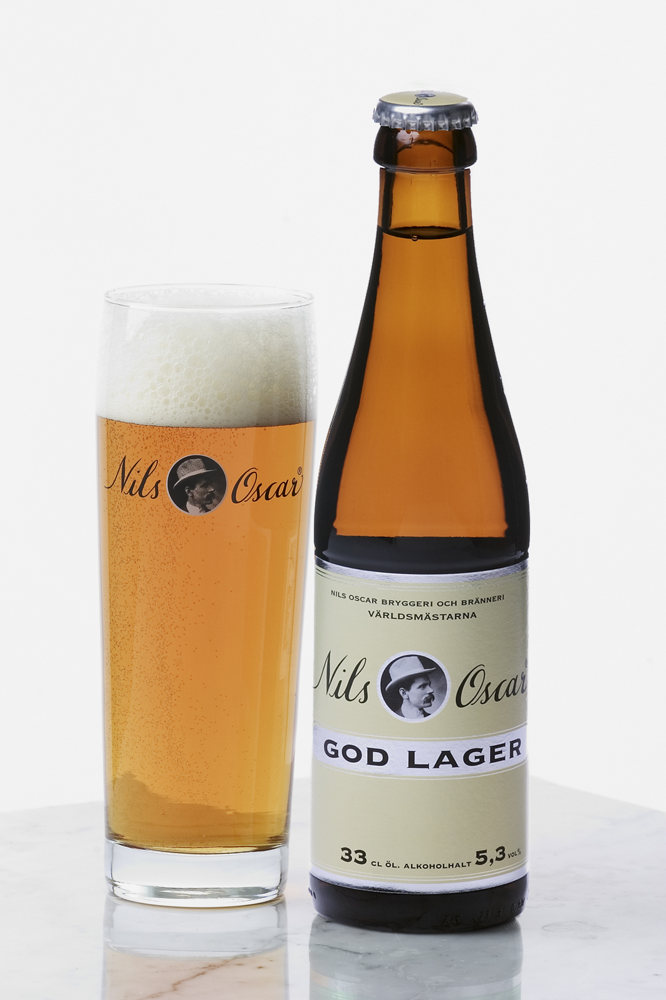

# golager

lager is "warehouse" in Germany.




##  Why golager?

golager is datum lager(datastore) written in golang. It's really a headache to store data in different cloud storage providers: aliyun oss, qiniu, aws, local file system, and so on. I want a small library to support them all in one and that's golager.


## What's in golager?

```
    .
    ├── assets
    │   ├── image
    │   └──
    ├── bin
    │   ├── apps
    │   │    └── golang
    │   └── bootstrap
    ├── config
    ├── external
    │   └── src
    │       ├── github.com
    │       ├── rust-advanced
    │       └── rust-introduction
    ├── src
    ├── tests
    └── README.md
```

## functions

- buckets
- upload

./build/bin/lager-oss upload README.md  /uyun-dev/temp/READ.md  "content-type:application/abc;cache-control:max-age=3600" "a:b;c:d"

- download


## how to use

```
export OSS_ACCESS_KEY_ID=<OSS_ACCESS_KEY_ID>
export OSS_ACCESS_KEY_SECRET=<OSS_ACCESS_KEY_SECRET>
export OSS_ENDPOINT=oss-cn-hangzhou.aliyuncs.com
./lager-cli oss download  /bucket/key localfile
```


```
QINIU_ACCESS_KEY=<QINIU_ACCESS_KEY>
QINIU_SECRET_KEY=<QINIU_SECRET_KEY>
QINIU_DOMAIN=<QINIU_DOMAIN>
./lager-cli qiniu download /bucket/key localfile
```

## TODO


## presigned url

aws: http://www.cheynewallace.com/uploading-to-s3-with-angularjs-and-pre-signed-urls/


## references

qshell: qiniu command line tool  [link](https://github.com/qiniu/qshell)

rclone: rsync for cloud storages [link](https://github.com/ncw/rclone)

go-kit: go libraries for microservices [link](https://github.com/go-kit/kit)

aliyun oss go sdk: [link](https://help.aliyun.com/document_detail/32144.html)

qiniu go sdk: [link](https://developer.qiniu.com/kodo/sdk/go)

go-ethereum: Makefile & Dockerfile [link](ttps://github.com/ethereum/go-ethereum)


